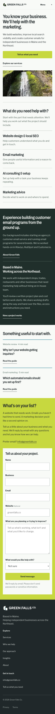
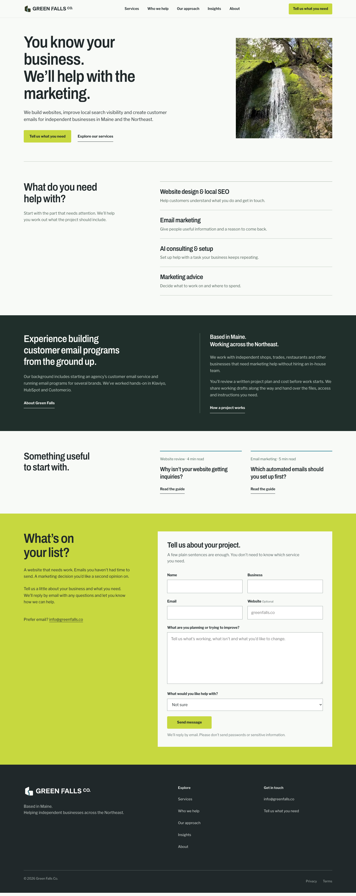

# Response to the Green Falls issues overview — October 8, 2026

The supplied CSV is an overview of 17 issue types and counts. It does not identify the affected URLs. I checked the current `greenfalls.co` responses and the 20 URLs in the sitemap before editing the source. The GitHub repository is a review copy; merging a change here does not deploy it to the production Site.

## Verified findings and changes

| Report category | Evidence | Change |
| --- | --- | --- |
| Missing security headers | The live homepage response lacked Referrer-Policy, X-Content-Type-Options, Content-Security-Policy, X-Frame-Options and HSTS. | Added these headers to Worker responses. HTML uses a per-request script nonce. Added equivalent headers for Cloudflare static assets in `public/_headers`. HSTS is sent on HTTPS responses. |
| Bad content type | The live `/images/green-falls-waterfall.webp` response was `application/octet-stream`. | The static asset header rule sets `image/webp`. The local production server now returns `image/webp`. |
| Internal links without anchor text | Both logo links on all 20 sitemap pages had no text or image alt text. They had an accessible label, which the crawler did not count as anchor text. | Added text inside both links using the existing visually hidden style. The links still have the same accessible name. |
| Short/long titles and descriptions | The live sitemap pages had two titles under 30 characters, seven over 60, one description under 70 and three over 155. | Edited the affected metadata using only claims already present in the page content. Local rendered output now has titles of 31–60 characters and descriptions of 129–153 characters across all 20 sitemap pages. |
| Repeated H2 headings | The shared contact form repeated “Tell us about your project.” on four pages. | Gave the form headings context for the home, contact, contractor and retailer pages. Shared footer and template headings remain where they describe the same navigation or section purpose. |

## Reviewed without adding content

- **Multiple H2 headings:** These pages have several sections, so multiple H2s are appropriate. The CSV itself notes that this is not inherently an issue.
- **Low content pages:** The overview does not name the three URLs, and its 200-word filter is not a minimum for search indexing. The legal and contact pages are intentionally direct. Adding unverified legal terms or filler would make them less useful.
- **Pixel-width warnings:** Character counts improved, but search-result width is approximate and can change. Only a new crawl of the deployed site can confirm whether these rows clear.

## Verification

- `npx vinext build`, both rendered test files, and `npx tsc --noEmit` passed.
- `npm run lint` passed with two warnings in generated `worker-configuration.d.ts`.
- A local production browser run at 390px and 1440px rendered the homepage and contact page with no console or page errors. Navigation to Services worked. No contact form submission was sent.
- The local 20-page crawl found no internal links without text and no title or description outside the configured character ranges.
- The built client output contains the static `_headers` rules. Production response headers and crawler counts require verification after deployment.

